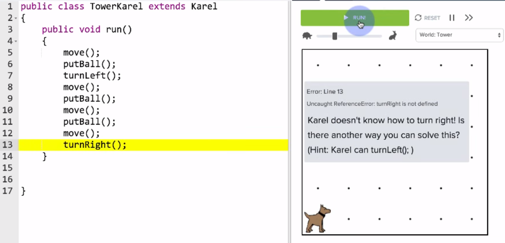

# Karel Can't Turn Right

You may have noticed that Karel can not turn right. Karel can only turn left. To get Karel to turn right, you have to write out three consecutive `turnLeft();` commands like so:

```
// Turning left three times is the same as turning right once.
turnLeft();
turnLeft();
turnLeft();
```

Wouldn't it be easier if we had a `turnRight();` command that did the same thing?

## Methods

In the previous chapter, we introduced the **run method**. This method is where our program starts executing our commands.

```
public void run()
{
    // Our code begins here
}
```

We can create additional methods using a similar syntax. A **method** is how we teach Karel new commands. By using the power of methods, we can teach Karel how to `turnRight();`. Here is the `turnRight()` method:

```
private void turnRight()
{
    turnLeft();
    turnLeft();
    turnLeft();
}
```

We write all of our commands within the **method body**; this is the area between the opening and closing curly brackets (`{}`).

## Tower and Turn Right

Let's have Karel build a tower and then `turnRight();` using methods.


```
public class TowerKarel extends Karel
{

    public void run()
    {
    	move();
        putBall();
        turnLeft();
        move();
        putBall();
        move();
        putBall();
        move();
        turnLeft();
        turnLeft();
        turnLeft();
    }
}
```

While this solution works, we aren't using a `turnRight()` method. Let's fix that.

```
public class TowerKarel extends Karel
{
    public void run()
    {
        move();
    	putBall();
    	turnLeft();
    	move();
    	putBall();
    	move();
    	putBall();
    	move();
    	turnRight();
    }
}
```

We replaced our three `turnLeft();` commands with one `turnRight();` command, but the program still does not work. Why is that?



When we run the program, we get an error message telling us that Karel does not know how to turn right. We still need to teach Karel how to `turnRight();` by writing a `turnRight()` method.

```
public class TowerKarel extends Karel
{
    public void run()
    {
        move();
    	putBall();
    	turnLeft();
    	move();
    	putBall();
    	move();
    	putBall();
    	move();
    	turnRight();
    }
    
    private void turnRight()
    {
        turnLeft();
        turnLeft();
        turnLeft();
    }
}
```

By writing a `turnRight()` method, we have taught Karel a new command and completed the program.


