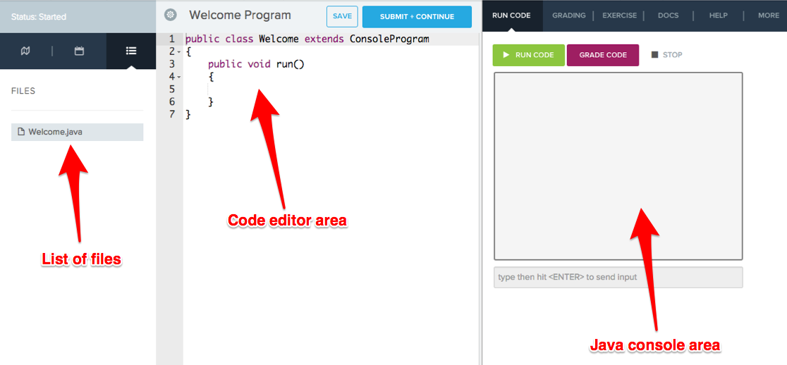

# Printing in Java

Now that you're comfortable using basic Java commands with Karel the Dog, it's time to move into the Java console environment.

### Environment Set Up
Using the CodeHS editor makes writing Java programs simple and straightforward. The Java console environment is similar to the Karel environment you've used already, with a few key differences. Instead of showinga grid world where Karel will execute the program, the Java environment presents a console area that will print the output of your program. There is also a list of files for each program on the left side of the page. Many of the Java programs you will write will make use of more than one file -- all of the files will be listed in this section.




### Writing Hello World
Writing a program that prints "Hello world" to the console requires a few lines of code:

```
public class HelloWorld extends ConsoleProgram
{
    public void run()
    {
        System.out.println("Hello world");
    }
}
```

There are a few key parts to pay attention to here:
- This program extends `ConsoleProgram` instead of `Karel`. This tells the program that it's going to use the console instead of a Karel grid world.
- The text is printed to the console with the `System.out.println()` command. This command looks a bit long, but you can think of it as telling the console to print whatever is inside the parentheses.

Now that you can print to the console, you'll be able to write programs that can display information to the user!
