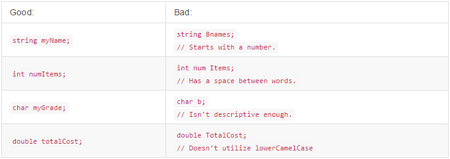

# Variables and Types

Variables allow us to store information such as numbers, words, or true/false expressions. A variable can be thought of as a box that stores information inside. In Java, variables are composed of three things: a name, type, and value. 

## Primitive Types

In Java we must specify what ***type*** of information we want our variables to hold. You must always give your variable a type before naming it, and specifying the value it holds. (Ex. ``
int myVariable = 10; ``)

Here are some of the primitive types found in Java:


## 
#### Numeric Type:
---

As seen above, primitive numeric types in Java include both integers and doubles. 

**Integers** are whole numbers, or counting numbers. 
(Ex. -5, -4, -3, -2, -1, 0, 1, 2, 3, 4, 5)

In Java we declare an integer using ``int`` before the variable name. Here are a couple of examples: 

```java
int itemsInStore = 10; 

int costOfShoes = 80;
```

**doubles** are like integers, but can have decimals. (Ex. -54.34, 90.21, 0.1223)

In Java we declare a double using ``double`` before the variable name. Here are a couple of examples:

```java
double costOfApple = 1.24;

double milesRan = 5.64;
```


## 
#### Char Type:
---

**Characters** represent a single character.

In Java we declare a character using ``char`` before the variable name. We also use single quotes to identify a character (Ex. ``'A'``). Here are a couple of examples:

```java
char currentGrade = 'A';

char favoriteLetter = 'W';
```

## 
#### Boolean Type:
---

**Booleans** are variables that hold a true or a false value.

In Java we declare a boolean using ``boolean`` before the variable name. Here are a couple of examples:

```java
boolean passedCalculus = true;

boolean hasDog = false;
```

## 
#### String Type:
---

**Strings** are variables that hold text. Strings are **not** a primitive type, so you must declare them using ``String`` with a capital **S**. Unlike characters, we need to use double quotes when assigning strings (Ex. ``"This is my string."``). Here are a couple of examples:

```java
String fishName = "Dog";

String myUniversity = "Arizona State University";
```

## Naming Variables

Giving your variables meaningful names throughout your code is very important. Proper variable names allow others to easily read and understand your code. A good way to name your variables is to give them as descriptive of a name as possible, without making it too long. For example, ``int numberOfApplesOnTheTree = 10;`` is a very long name, and can easily be replaced with a name like ``int numApples = 10;``.


Variable Naming Conventions:

- Variable names must start with a letter, ``$`` symbol, or ``_`` symbol.

- Variable names are case sensitive so ``myVariable`` is different than ``MyVariable``

- Variable names, after the first character, can contain letters, numbers, or other characters.


Here are some examples of different variable names:



