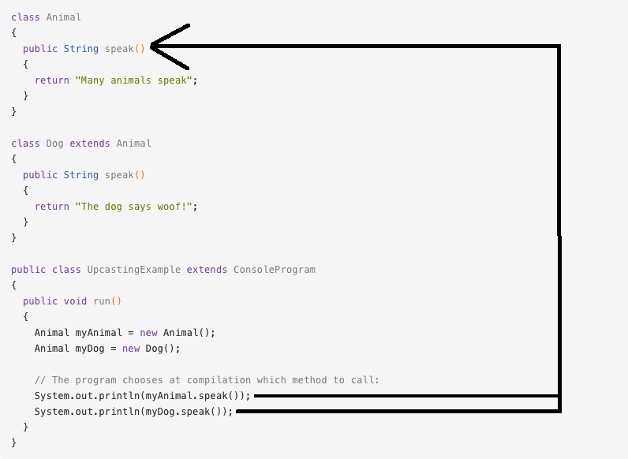

# Polymorphism
<hr>
***Polymorphism*** is one of the most important concepts in Object Oriented Programming.
<br>
<br>
***Polymorphism*** is the capability of a single object to take on multiple forms. ***Polymorphism*** can also be explained as the ability to perform a single action in many ways across multiple objects. It also allows us to use the same method across different objects, using different implementations. 

### Concepts of Polymorphism
<hr>
There are several concepts of ***polymorphism*** that are crucial to remember. These include:

- **Upcasting: ** Occurs when the reference variable of a super class refers to the object of the subclass. This allows us to go from a low level class type to a higher level one.

- **Downcasting: ** Occurs when the reference variable of a subclass is being set to an object of the superclass type. This will manually convert the object type to that of the subclass.
<br>
(ex: `Animal animal = new Fox();` `Fox castedFox = (Fox) animal`)

- **Dynamic Binding: ** The concept where the proper method implementation is chosen at run-time, and not compilation.

- **Static Binding: ** The concept where the proper method implementation is chosen at compilation, and not run-time.

- **Method Overriding: ** Allows us to call the correct implementation of a method across multiple objects that share the same superclass.

### Upcasting:
<hr>
***Upcasting*** refers to taking an object of a lower level class type and referencing it to a class of a higher level. Lets look at an example of this:

```Java
class Animal
{
  public abstract String speak();
}

class Dog extends Animal
{
  public String speak()
  {
    return "The dog says woof!";
  }
}

class Fox extends Animal
{
  public String speak()
  {
    return "What does the fox say?";
  }
}

public class UpcastingExample extends ConsoleProgram
{
  public void run()
  {
    Animal myDog = new Dog(); // Upcasting to `Animal`
    Animal myFox = new Fox(); // Upcasting to `Animal`
  
    System.out.println(myDog.speak()); // Will print `The dog says woof!`
    System.out.println(myFox.speak()); // Will print `What does the fox say?`
  }
}
```
### Downcasting
<hr>
***Downcasting*** is conversion of a reference variable's type to that of the subclass. One important difference in ***downcasting***, as compared to ***upcasting***, is that you must downcast manually. Lets look at an example of this:

```Java
class Animal
{
  public abstract String speak();
}

class Dog extends Animal
{
  public String speak()
  {
    return "The dog says woof!";
  }
}

class Fox extends Animal
{
  public String speak()
  {
    return "What does the fox say?";
  }
}

public class UpcastingExample extends ConsoleProgram
{
  public void run()
  {
    // Upcasting is done automatically
    Animal myDog = new Dog(); // Upcasting to `Animal`
    Animal myFox = new Fox(); // Upcasting to `Animal`
  
    // Downcasting must be done manually
    Dog yourDog = (Dog) myDog; // Downcasting from `Animal`
    Fox yourFox = (Fox) myFox; // Downcasting from `Animal`
  
    System.out.println(yourDog.speak()); // Will print `The dog says woof!`
    System.out.println(yourFox.speak()); // Will print `What does the fox say?`
  }
}
```

### Dynamic Binding
<hr>
***Dynamic Binding*** is a very important concept to ***runtime polymorphism***. It is the concept of the proper method implementation being chosen at run-time. Lets look at an example:


### Static Binding
<hr>
***Static Binding*** is another important concept to ***polymorphism***. Unlike ***dynamic binding***, ***static binding*** chooses the proper method implementation at compilation, and not run-time. Since ***static binding*** chooses the proper implementation at compile-time, it only checks the type of the reference variable and not where it is pointing. Lets look at an example of this concept:


### Method Overriding
<hr>
***Method Overriding*** allows us to use the same method across multiple objects with differing implementations. Lets take a look at some examples of this concept:

```Java
class Animal
{
  public abstract String speak();
}

class Dog extends Animal
{
  public String speak()
  {
    return "The dog says woof!";
  }
}

class Fox extends Animal
{
  public String speak()
  {
    return "What does the fox say?";
  }
}
public class UpcastingExample extends ConsoleProgram
{
  public void run()
  {
    Animal myFox = new Fox();
    Animal myDog = new Dog();
    
    /* Polymorphism here is seen as the correct implementaiton of `speak()`
     * being chosen, regardless of the object type. */
     
    System.out.println(myFox.speak()); // Will print `What does the fox say?`
    System.out.println(myDog.speak()); // Will print `The dog says woof!`
  }
}
```

### Polymorphic Arrays
<hr>
***Polymorphic Arrays*** allow us to store an array of objects with differing types that share the same superclass. Lets see this in action:

```Java

```


