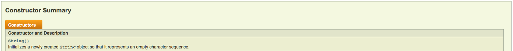
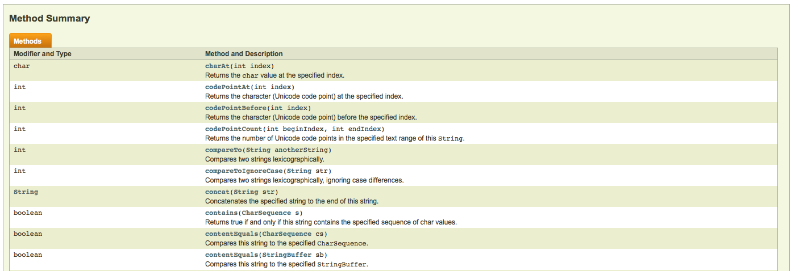

# Using a Class as a Client

In Java, you can think of everything as a class. If you want to write a program to act as a grade book, ***Grade Book*** is a class. The same can be thought of with any program you code in Java.

Since you can think of everything as a class in Java, you can bundle these classes and their functionality. You can even use classes that are written by other people without knowing exactly how they work.

Whenever you use a class, it is class a ***client of the class***.

### Reading Documentation

Documentation is a great resource to use to see how a class works. As long as you can read the documentation, you don't need to know how the class works.

Here is an example of the documentation for the String Class:

(http://docs.oracle.com/javase/7/docs/api/java/lang/String.html)

The documentation for a class tells us how to use the class constructor, and various methods that the class provides. 

Here is another example of documentation:

(https://codehs.com/editor/slides/75977/97708/277/53)

This documentation is for the Rectangle Class that you have worked with in previous exercises.