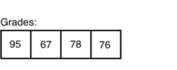

# ArrayList Methods
Arrays are amazing tools! Unfortunately, they lack flexibility and useful methods. That's where ArrayList comes into play. An ArrayList is similar to an Array, except it is resizable and has more functionality. 

### ArrayLists
You can think of an ArrayList as a container that will resize as we add and remove objects from it. 



### Creating ArrayLists
They way we create an ArrayList varies from the way we create an Array. To create an ArrayList we use: `ArrayList<type> variableName = new ArrayList<type>();`. It is also import to know ArrayLists can't store primitive types, so we must use ``Integer`` for ints and ``Double`` for doubles

Lets say we want to create an ArrayList that holds the grades for a class. Here is an example of what that code would look like:

```Java
// Import the ArrayList
import java.util.*;

public class ArrayListExample extends ConsoleProgram
{
  public void run()
  {
    // Create the ArrayList named `classGrades` and set its type to `Integer`
    ArrayList<Integer> classGrades = new ArrayList<Integer>();
    
    // Add the grades to our ArrayList
    classGrades.add(97);
    classGrades.add(50);
    classGrades.add(80);
    classGrades.add(90);
  }
}
```

Now we want to create a list of students in a classroom. We can use the ArrayList for this as well:

```Java
// Import the ArrayList
import java.util.*;

public class ArrayListExample extends ConsoleProgram
{
  public void run()
  {
    // Create the ArrayList named 'students' and set its type to 'String'
    ArrayList<String> students = new ArrayList<String>();
    
    // Add the students to our ArrayList
    students.add("Stephen");
    students.add("Wezley");
    students.add("Wade");
  }
}
```
### ArrayList Methods
After creating and populating your ArrayList you can perform multiple operations on it.

##### Adding to an ArrayList
To add a value to an ArrayList you use `list.add(elem);`. Here is an example using our `classGrades` and `students` ArrayLists:

```Java
classGrades.add(100);
students.add("Trevor");
```

##### Adding at a Specific Index
ArrayLists also allow us to add an item at a specific index using `list.add(index, elem);`. Here is an example using our `classGrades` and `students` ArrayLists:

```Java
classGrades.add(1, 29); // Adds '29' to index 1, and shifts everything right
students.add(2, "Kyle"); // Adds 'Kyle' to index 2, and shifts everything right
```

##### Getting a Value
To get a value from your ArrayList you use `list.get(index);`. Here is an example using our `classGrades` and `students` ArrayLists:

```Java
int grade = classGrades.get(2); // Will return `80`
String student = students.get(1); // Will return `Wezley`
```

##### Setting a Value
With ArrayLists we can set a specific index's value using `list.set(index, value);`. Here is an example using our `classGrades` and `students` ArrayLists:

```Java
classGrades.set(1, 90); // Will change the value at index 1 to `90`
students.set(0, "Willy"); // Will change the value at index 0 to `Willy`
```

##### Getting Size of an ArrayList
We can also access the length or size of a specific ArrayList using `list.size();`. Here is an example using our `classGrades` and `students` ArrayLists:

```Java
int gradeSize = classGrades.size(); // Will return 4
int classSize = students.size(); // Will return 3
```

##### Removing From ArrayList
Finally, we can remove a specific item from our ArrayList using `list.remove(index);`. Here is an example using our `classGrades` and `students` ArrayLists:

```Java
classGrades.remove(1); // Removes `50` from `classGrades`
students.remove(0); // Removes `Stephen` from `students`
```

### Iterating Over ArrayLists

As with traditional Arrays, we can iterate over ArrayLists.

We can use a regular for loop to iterate over our ArrayList like:

```Java
// Loops through `classGrades`
for(int i = 0; i < classGrades.size(); i++)
{
    // Prints out our class grades
    int grade = classGrades.get(i);
    System.out.println(grade);
}
```

We also have the option of using a For Each loop to iterate over our ArrayList like:

```Java
// Loops through `students`
for(String name : students)
{
  // Prints the name of our students
  System.out.println(name); 
}
```