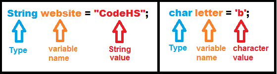

# Strings and Characters
Let's review some key differences between Strings and characters:

| Strings | characters |
| -- | -- |
| Type: String | Type: char |
| Object | primitive |
| Compare using the `.equals()` method| Compare using `==` |
| Surrounded by double quotes (Example: "hello") | Surrounded by single quotes (Example: 'a') |
| Sequence of characters (Example: "hello") | A single character (Example: 'a')|

Here is an example of declaring a String in Java:
```
String website = "CodeHS";
```
And here is an example of declaring a character in Java:
```
char letter = 'b';
```

Let's break apart these two examples into their individual components:



Highlighted in blue is the type. On the left, we have the type for Strings, `String`. On the right, we have the type for characters, `char`. Highlighted in orange is the name of our variables. We can name them whatever we want, but our names should follow proper naming conventions and make sense. Highlighted in red is the value. This is the actual String and character we are assigning to our variable.

## Characters are Numbers!

Computers prefer working with numbers rather than letters. Thus, every character is actually a unique number behind the scenes. The table below lists each character's assigned number. This table is known as the **ASCII** (***A***merican ***S***tandard ***C***ode for ***I***nformation ***I***nterchange) **table**:


The table has three columns. The first column, `Hex`, gives us each character as a **hexadecimal number**. Hexadecimal numbers are just another way for us to represent each character, but for now, we will ignore this column. It isn't important to us right now. The second column, `Dec`, gives us each character as a **decimal number**. Decimal numbers are the standard numbers that we are all used to working with (0, 1, 2, 3, 4, etc.). The third column, `Char`, lists each of the corresponding characters.

It is important to remember that lowercase and capital letters are assigned different numbers. For example, the capitalized character 'A' is the number 65 whereas the lowercase character 'a' is the number 97. 

You will also notice that there are a lot of special characters like "NULL" (number 0), "TAB" (number 9), and "CAN" (number 24). Most of these special characters are abbreviated, so they are spelled out more clearly to the right. For example, "CAN" stands for "Cancel". Even things like spaces (number 32), exclamation points (number 33), dollar signs (number 36), and semicolons (number 59) are considered characters!

### Characters as Numbers in a Program

Here is a program that prints out different characters as numbers:

```
public class CharsAreNumbers extends ConsoleProgram
{
    // If you want to see more about the ints behind every
    // char take a full look at the ASCII table
    // You can also find the ASCII table at http://www.asciitable.com/
    public void run()
    {
        // 'a' has the ASCII value 97
        System.out.println("Testing if 'a' has the ASCII value 97:");
        char lowercaseA = 'a';
        System.out.println("'a' as a letter: " + lowercaseA);
        System.out.println("'a' as a number: " + (int)lowercaseA);

        // 'A' has the ASCII value 65
        System.out.println();
        System.out.println("Testing if 'A' has the ASCII value 65:");
        char uppercaseA = 'A';
        System.out.println("'A' as a letter: " + uppercaseA);
        System.out.println("'A' as a number: " + (int)uppercaseA);
        
        // 'j' has the ASCII value 106
        System.out.println();
        System.out.println("Testing if 'j' has the ASCII value 106:");
        char lowercaseJ = 'j';
        System.out.println("'j' as a letter: " + lowercaseJ);
        System.out.println("'j' as a number: " + (int)lowercaseJ);
        
        // 'J' has the ASCII value 74
        System.out.println();
        System.out.println("Testing if 'J' has the ASCII value 74:");
        char uppercaseJ = 'J';
        System.out.println("'J' as a letter: " + uppercaseJ);
        System.out.println("'J' as a number: " + (int)uppercaseJ);
        
        // '!' has the ASCII value 33
        System.out.println();
        System.out.println("Testing if '!' has the ASCII value 33:");
        char exclamationPoint = '!';
        System.out.println("'!' as a character: " + exclamationPoint);
        System.out.println("'!' as a number: " + (int)exclamationPoint);
        
        // '$' has the ASCII value 36
        System.out.println();
        System.out.println("Testing if '$' has the ASCII value 36:");
        char dollarSign = '$';
        System.out.println("'$' as a character: " + dollarSign);
        System.out.println("'$' as a number: " + (int)dollarSign);
    }
}
```

Here we are testing to make sure that each of these characters correspond correctly to their ASCII table numbers. First, we test lowercase and capital letters 'a' and 'A' as well as 'j' and 'J'. Then we test a couple of non-letter characters, the exclamation point ('!') and dollar symbol ('$').  Does it work? Does our output match with the ASCII table above? Let's run the program to check:

```
Testing if 'a' has the ASCII value 97:
'a' as a letter: a
'a' as a number: 97

Testing if 'A' has the ASCII value 65:
'A' as a letter: A
'A' as a number: 65

Testing if 'j' has the ASCII value 106:
'j' as a letter: j
'j' as a number: 106

Testing if 'J' has the ASCII value 74:
'J' as a letter: J
'J' as a number: 74

Testing if '!' has the ASCII value 33:
'!' as a character: !
'!' as a number: 33

Testing if '$' has the ASCII value 36:
'$' as a character: $
'$' as a number: 36
```

Looks good!

#### Adding and Subtracting Characters

Yes! You heard that right. Because characters are numbers, we can add and subtract them. How does this work? Take a look at the example program below:

```
public class CharsAreNumbers extends ConsoleProgram
{
    // If you want to see more about the ints behind every
    // char take a full look at the ASCII table
    // You can also find the ASCII table at http://www.asciitable.com/
    public void run()
    {
        // 'C' is 2 characters after 'A'
        System.out.println("SUBTRACTING EXAMPLE:");
        System.out.println("'C' as a number: " + (int)'C');
        System.out.println("'A' as a number: " + (int)'A');
        System.out.println("Thus, 'C' is 2 characters after 'A'");
        int difference = 'C' - 'A';
        System.out.println("'C' - 'A' = " + difference);
        
        // 'K' is 10 characters after 'A'
        System.out.println();
        System.out.println("ADDING EXAMPLE:");
        System.out.println("'K' is 10 characters after 'A'");

        char tenAfter = (char)('A' + 10);
        System.out.println("'A' + 10 = " + tenAfter);
        
        System.out.println("How does that work?");

        char capitalA = 'A';
        System.out.println(capitalA);
        System.out.println(".... has the int value ...");
        
        int capitalAInt = (int)capitalA;
        System.out.println(capitalAInt);
        
        System.out.println(".... add 10 and you get ...");
        int capitalAPlusTen = capitalAInt + 10;
        System.out.println(capitalAPlusTen);
        
        System.out.println("... cast that back to a char and you get...");

        char backToChar = (char)capitalAPlusTen;
        System.out.println(backToChar);
    }
}
```
After we run the program, we get a better idea of what is happening:

```
SUBTRACTING EXAMPLE:
'C' as a number: 67
'A' as a number: 65
Thus, 'C' is 2 characters after 'A'
'C' - 'A' = 2

ADDING EXAMPLE:
'K' is 10 characters after 'A'
'A' + 10 = K
How does that work?
A
.... has the int value ...
65
.... add 10 and you get ...
75
... cast that back to a char and you get...
K
```
First, we print out 'C' and 'A' as numbers. 'C' is the number 67 and 'A' is the number 65, so we know that 'C' must be 2 characters after 'A'. When we subtract the two characters, 'C' - 'A', we confirm that  their difference is 2.

Then, we add the number 10 to the character 'A'. We can do this because 'A' is a number! We get a character result of 'K'. But why? Well, 'A' is the number 65, so when we add 10 to it we get a number of 75. What character corresponds to the number 75? 'K' does! 'K' is also the number 75.

#### Converting Cases

If you look at the ASCII table, you might notice that capital letters and their equivalent lowercase letters are exactly 32 numbers away. We can use this to manually convert between lowercase and capital letters!

```
public class ConvertCharsToUppercase extends ConsoleProgram
{
    // This program manually converts each character in a String to uppercase
    public void run()
    {
        // Read a string
        System.out.println("Manually convert each character in a String to uppercase:");
        String str = readLine("Enter any String: ");
        
        // Loop over the String
        for(int i = 0; i < str.length(); i++)
        {
            // Get each individual character from the String
            char cur = str.charAt(i);
            // Convert that character to uppercase
            if (cur >= 97 && cur <= 122)
            {
                System.out.print((char)(cur - 32));
            }
            else
            {
                System.out.print(cur);
            }
        }
    }
}
```

First, we read a String from the user. Then, we loop over the String as was taught in the previous Strings Methods chapter. Within the loop, we get each individual character in the String. From the ASCII table, we can see that all lowercase letters fall within the range between 97 and 122, inclusive. Thus, we have an if statement to ensure that **only** lowercase letters are converted to uppercase. If the current character is not within the acceptable lowercase letter range, our else statement ensures that we simply print back the character without changing it at all.

For example, the letter 'a' is the number 97 and the letter 'x' is the number 120. Both fall in this acceptable range, so they will be properly converted to uppercase. Punctuation marks, uppercase letters, and everything else does not get converted as none of those characters fall in the acceptable lowercase letter range.

Here is an example of running this program. Many other possiblilties exist as the user is free to enter any String they want:

```
Manually convert each character in a String to uppercase:
Enter any String: This String will be converted to all uppercase letters!!!
THIS STRING WILL BE CONVERTED TO ALL UPPERCASE LETTERS!!!
```

It works! The String we inputted was successfully converted to all uppercase. Notice how the exclamation points still show up properly in our converted String. This is because '!' has the number 33, so it didn't fall within our acceptable lowercase letter range. We didn't need to subtract anything from it.


## Escape Sequences

**Escape sequences** are characters with special meaning. While it might look like they consist of multiple characters, they are actually treated as if they are a single character. They always start with a backslash (`\`). The table below gives some examples of common escape sequences:

| Escape Sequence | Description |
| -- | -- |
| \t | tab |
| \n | new line |
| \' | single quote |
| \" | double quote |
| \\\ | backslash |

So what is the reason for having these escape sequences? Their purpose is illustrated in the example program below:

```
public class EscapeSequences extends ConsoleProgram
{
    public void run()
    {
        // We can quote what someone has said
        String quote = "John says, \"Hello!\"";
        System.out.println(quote);
        
        // We can use the \n to add a new line!
        String manyLines = "First Line\nSecond Line\nThird Line";
        System.out.println(manyLines);
        
        // Two backslashes (\\) let's us actually use the backslash itself in a String
        String backslashInString = "\\n is an escape sequence that adds a newline.";
        System.out.println(backslashInString);
    }
}
```
When we run this program, we get the following output:

```
John says, "Hello!"
First Line
Second Line
Third Line
\n is an escape sequence that adds a newline.
```

If we didn't have these escape sequences, our program would not work properly! The double quotes in our first String will confuse Java if they are not escaped properly. Without the backlash in front of the double quotes, the String would get broken apart right in the middle. This would cause an error when we run the program!

In our second String, it is much simpler to use `\n` to create new lines. Otherwise, we would have to write a series of empty println statements to get the same effect.

In our third String, we want to print out a backslash, so we need to use the two backslashes. If we only had a single backslash, we would accidentally create a new line instead.

## The Character Class

Just like how there is a String class that lets us use a variety of different methods on Strings, there is also a Character class. The Character class lets us use a variety of different methods on characters. 

**Important: `Character` is different than `char`.** `Character` is a class while `char` is a primitive type. You can not use methods on the primitive type, `char`. You will learn more about these differences and why they exist in future chapters.

### Useful Methods in the Character Class

There are many useful methods you will want to know about in the Character class. Some of the most useful methods are given in the table below:


For a full list of all the methods in the Character class, you can visit the relevant page in the Java documentation [here](https://docs.oracle.com/javase/7/docs/api/java/lang/Character.html). But for now, we will just be focusing on the methods in the table above.

These methods are all **static methods**. This means you call these methods on the Character class rather than an instance of the Character class. Take this as an example:

```
public class CharacterMethods extends ConsoleProgram
{
    public void run()
    {
        String str = "abc4";
        char lastChar = str.charAt(3);
        if (Character.isDigit(lastChar))
        {
            System.out.println("Yep! The last character in str is a digit.");
        }
    }
}
```
Notice how we call the String `charAt()` method on our variable name `str`. This means we are calling this method on an **instance** of the String class. However, we call the Character `isDigit()` method on the Character class itself rather than an instance of the Character class. This is the major difference between the two.

This may still be a little confusing to you right now, but you will learn more about static methods in future chapters. For now, just remember that you call Character methods on the Character class itself.

#### Character Methods in a Program

Let's look at an example of using a Character class method in the example program below:

```
public class CharacterMethods extends ConsoleProgram
{
    public void run()
    {
        char ch = 'f';
        
        if(Character.isUpperCase(ch))
        {
            System.out.println("It is uppercase!");
        }
        else
        {
            System.out.println("It is not uppercase");
        }
        
        
    }
}
```

We declare a character `ch` with a value of a lowercase `f`. We call the `isUpperCase()` method on our character. If the character is uppercase, we print that out informing the user. Otherwise, we inform the user that it is not uppercase. When we run this program, our program prints out: `It is not uppercase`. If we were to change that lowercase `f` to an uppercase `F`, our program prints out: `It is uppercase!` instead.


