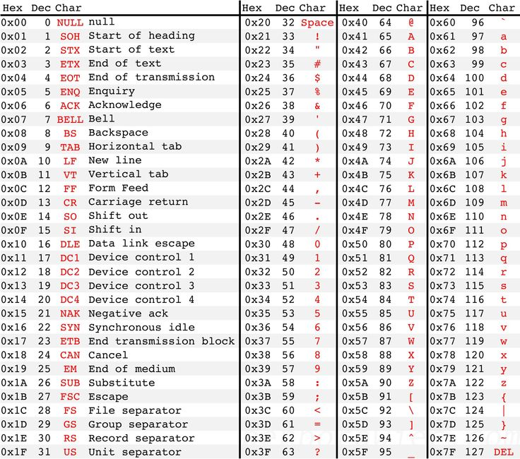

# Strings and Characters
Let's review some key differences between Strings and characters:

| Strings | characters |
| -- | -- |
| Type: String | Type: char |
| Object | primitive |
| Compare using the `.equals()` method| Compare using `==` |
| Surrounded by double quotes (Example: "hello") | Surrounded by single quotes (Example: 'a') |
| Sequence of characters (Example: "hello") | A single character (Example: 'a')|

Here is an example of declaring a String in Java:
```
String website = "CodeHS";
```
And here is an example of declaring a character in Java:
```
char letter = 'b';
```

Let's break apart these two examples into their individual components:


Highlighted in blue is the type. On the left, we have the type for Strings, `String`. On the right, we have the type for characters, `char`. Highlighted in orange is the name of our variables. We can name them whatever we want, but our names should follow proper naming conventions and make sense. Highlighted in red is the value. This is the actual String and character we are assigning to our variable.

## Characters are Numbers!

Computers prefer working with numbers rather than letters. Thus, every character is actually a unique number behind the scenes. The table below lists each character's assigned number. This table is known as the ASCII table:




