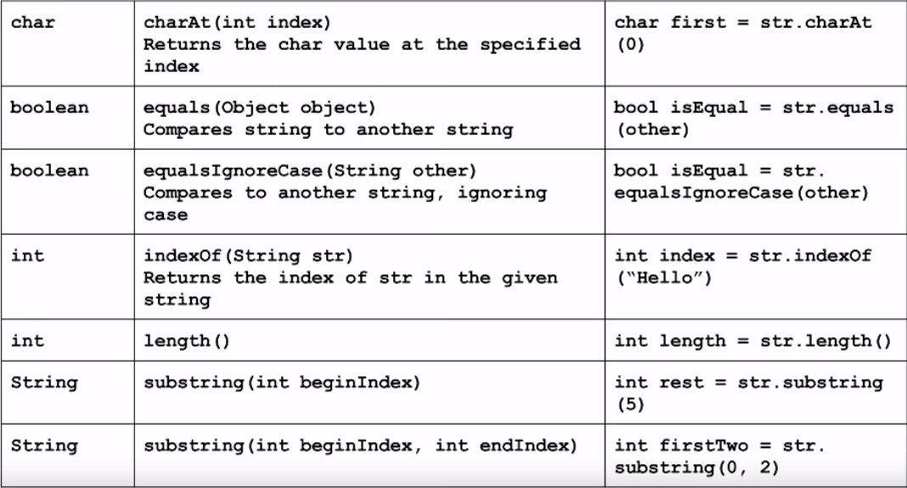

# Strings Methods

You will remember that Strings are a sequence of characters. Let's look at this example String below:

```
String str = "Hello World"
```

Here is a way to think about this String as a sequence of individual characters:

| 0  | 1  | 2  | 3  | 4  | 5  | 6  | 7  | 8  | 9  | 10 |
| -- | -- | -- | -- | -- | -- | -- | -- | -- | -- | -- |
| H  | e  | l  | l  | o  |    | W  | o  | r  | l  | d  |

Each character in this string has a position from 0 to 10. For example, the first character, *'H'*, is at position 0. The second character, *'e'*, is at position 1. The last character, *'d'*, is at position 10. You will note that the space between the two words, *' '*, is also a character and is located at position 5. 

**A character's particular position in a string is formally known as its *index*.**

## String Review

Let's review some key points about Strings:

* Strings are **objects**.
* Strings are **not** primitive types (like `char`, `int`, `boolean`, `double`, etc.).
* A **S**tring starts with a capital letter whereas primitive types are all lowercase.
* Since Strings are objects, we must use the `.equals()` method to determine if two Strings are exactly the same. Using `==` to compare two Strings will result in buggy programs.
  * `string1.equals(string2)` **is** the correct way to compare two Strings. `string1 == string2` is **NOT** the correct way to compare two Strings.

## Notes About The Java Documentation

* **The Java Documentation** is the reference for how to use different methods and classes. 
  * [The full Java documentation for all methods and classes is located here](https://docs.oracle.com/javase/7/docs/api/). 
* In this chapter, we will be focusing specifically on the documentation for Strings ([located on this page](https://docs.oracle.com/javase/7/docs/api/java/lang/String.html)).
* Tip: you can find a specific page in the documentation using a search engine like Google. When searching for a specific method or class, search using the keywords "Java  [method or class]". 
  * [For example, here is a Google search for the Java String Documentation](https://www.google.com/search?q=java+string).
  * This is often easier than navigating through the full Java Documentation website.

## String Methods

[If you go to the String documentation page](https://docs.oracle.com/javase/7/docs/api/java/lang/String.html), you will notice that there are ***a lot*** of different methods we can use on Strings. In this section, we will be focusing on some of the key methods from that page which are listed in the table below:



The *left-most column* in the table shows us the return type of the method. The *middle column* in the table shows us the **method signature**. The method signature includes the name of the method and its parameters. The middle column also tells us what the method does. The *right-most* column gives an example of using the method.

### The equals Method versus the equalsIgnoreCase Method

You have already learned about using the `.equals()` method in the previous Strings chapter. The `.equalsIgnoreCase()` method does the same thing, but it ignores differences in **case** between the two strings. Essentially, this means that we ignore differences in capitalization. For example, the three Strings *"Hello world"*, *"Hello World"*, and *"HELLO WORLD"* are all equal when we ignore case.

### Using the indexOf Method

The `indexOf()` method tells us the starting position, or the **index**, of a String within another String. For example, here we are finding the index of the String *"Hello"* within the String *"Hello World!"*:

```
public class IndexOfExample extends ConsoleProgram
{
    public void run()
    {
        String str = "Hello World!";
        int index = str.indexOf("Hello");
        System.out.println("The index is " + index);
    }
}
```
Let's take a quick look back at our chart above:

| 0  | 1  | 2  | 3  | 4  | 5  | 6  | 7  | 8  | 9  | 10 |
| -- | -- | -- | -- | -- | -- | -- | -- | -- | -- | -- |
| H  | e  | l  | l  | o  |    | W  | o  | r  | l  | d  |

Remember, a character's particular position in a string is formally known as its index. The top row gives us the index of each character on the corresponding bottom row.

You will notice that *"Hello"* begins at index 0. When we run our program, it prints out `The index is 0` as we expect.

Consider another example:

```
public class IndexOfExample2 extends ConsoleProgram
{
    public void run()
    {
        String str = "Hello World!";
        int index = str.indexOf("World");
        System.out.println("The index is " + index);
    }
}
```
Here we are finding the index of the String *"World"*. From out chart above, we see that this String begins at index 6. Does our program agree? After running the program, it prints `The index is 6`. Hooray! Our program matches with what we expect!

**But what if we look for the index of a String that does not exist?**

```
public class IndexOfExample3 extends ConsoleProgram
{
    public void run()
    {
        String str = "Hello World!";
        int index = str.indexOf("banana");
        System.out.println("The index is " + index);
    }
}
```
Here we are looking for the index of the String *"banana"* inside of the String *"Hello world!"*. No such index exists! So what happens when we run the program?

Output: `The index is -1`

**When a String has no index within another String, it returns a value of -1.** Since an index can not be negative, getting a return value of -1 tells us the index was not found.

### Using the charAt Method

The `charAt()` method returns the character at a specified index. Let's break apart another String into its individual indexes:

| 0  | 1  | 2  | 3  | 4  | 5  | 6  | 7  | 8  | 9  | 10 | 11 | 12 | 13 | 14 | 15 |
| -- | -- | -- | -- | -- | -- | -- | -- | -- | -- | -- | -- | -- | -- | -- | -- |
| S  | t  | r  | i  | n  | g  | s  |    | a  | r  | e  |    | f  | u  | n  | !  |

Let's get the first, fourth, ninth, eleventh, and fifteenth character in this String using the `charAt()` method:

```
public class CharAtExamples extends ConsoleProgram
{
    public void run()
    {
        String str = "Strings are fun!";
        
        // Get the first character (index 0)
        char first = str.charAt(0);
        System.out.println("The first character at index 0 is " + first);
        
        //Get another character at index 4
        char fourth = str.charAt(4);
        System.out.println("The character at index 4 is " + fourth);
        
        //Get another character at index 9
        System.out.println("The character at index 9 is " + str.charAt(9));
        
        //Get another character at index 11
        char eleventh = str.charAt(11);
        System.out.println("The character at index 11 is " + eleventh);
        
        //Get another character at index 15
        char fifteenth = str.charAt(15);
        System.out.println("The character at index 15 is " + fifteenth);
    }
}
```

Does the output of our program match the table above?:

```
The first character at index 0 is S
The character at index 4 is n
The character at index 9 is r
The character at index 11 is  
The character at index 15 is !
```

Our program works! 

**What happens if we try to look at an index that exceeds the String's length?** Like trying to get a character at index 16 when there are only 15 total indexes:

```
public class CharAtOutOfBounds extends ConsoleProgram
{
    public void run()
    {
        String str = "Strings are fun!";
        char sixteenth = str.charAt(16); //Index 16 does not exist!
        System.out.println("The character at index 16 is " + sixteenth);
    }
}
```

We get an error; our program throws a `IndexOutOfBoundsException` exception:

```
Exception in thread "main" java.lang.StringIndexOutOfBoundsException: String index out of range: 16
	at java.lang.String.charAt(String.java:658)
	at CharAtOutOfBounds.run(CharAtOutOfBounds.java:6)
	at ConsoleProgram.main(ConsoleProgram.java:21)
```

Always make sure to stay within a String's total index range to avoid these errors!

### Using the substring Method

The `substring(int beginIndex, int endIndex)` method returns a String given a starting index and an ending index. If you give no ending index, `substring(int beginIndex)`, it returns the entire remaining string starting from the beginning index.

Consider our example String from before:

| 0  | 1  | 2  | 3  | 4  | 5  | 6  | 7  | 8  | 9  | 10 | 11 | 12 | 13 | 14 | 15 |
| -- | -- | -- | -- | -- | -- | -- | -- | -- | -- | -- | -- | -- | -- | -- | -- |
| S  | t  | r  | i  | n  | g  | s  |    | a  | r  | e  |    | f  | u  | n  | !  |

What if we wanted to get each individual word out of the sentence? How would we do this? We can use substrings!

```
public class GettingSubstrings extends ConsoleProgram
{
    public void run()
    {
        String stringsAreFun = "Strings are fun!";
        
        // Get the first word in the String
        String firstWord = stringsAreFun.substring(0, 7);
        System.out.println("The first word is: " + firstWord);
        
        // Get the second word in the String
        String secondWord = stringsAreFun.substring(8, 11);
        System.out.println("The second word is: " + secondWord);
        
        // Get the third word in the String
        String thirdWord = stringsAreFun.substring(12, 16);
        System.out.println("The third word is: " + thirdWord);
    }
}
```

Output:

```
The first word is: Strings
The second word is: are
The third word is: fun!
```

#### Inclusive versus Exclusive Indexes:

**Important!** The beginning index is **inclusive**! The ending index is **exclusive**! For example:


When we get the first word using the substring method, we give a starting index of 0 and an ending index of 7. The 0 is inclusive, meaning 0 is included in the range. However, the 7 is exclusive, meaning 7 is **not** included in the range.

In short, we are actually returning the substring from indexes 0 - 6. Index 7 is **not** included!


This is how we can have an ending index of 16 when getting the third word. The 16th index is **not** included in the substring, so the program won't throw an `IndexOutOfBoundsException` error.


#### Strings are Immutable:

Strings are **immutable**! This means that they can **not** be changed or modified in anyway. When you use substring or any similar String method, you are actually getting an entirely **new** String.

## Looping Over a String

Looping through the contents of a String is something that is essential to know. The general for loop for doing just that is given below:

```
for(int i = 0; i < str.length(); i++)
{
    char cur = str.charAt(i);
    System.out.println(cur);
}
```

Our for loop looks at each individual character in the String. We use the variable `i` to keep track of the current index. The loop starts by getting the first character at index 0 using the `charAt()` method. It stores this character into the variable, `cur`, and then prints it out. Our loop continues to give us the characters at each consecutive index until we reach the last character in the String. We know how long our string is by using the `length()` method. 

Here is a program that loops through the *"Hello World!"* String:

```
public class LoopingOverString extends ConsoleProgram
{
    public void run()
    {
        String str = "Hello World!";
        
        int length = str.length();
        System.out.println("Character length of String: " + length);
        
        for(int i = 0; i < str.length(); i++)
        {
            char cur = str.charAt(i);
            System.out.println("Index" + i + ": " + cur);
        }
    }
}
```

First, we print out the length of the string by calling the `length()` method on it. Our String is 12 characters long. Next, we loop through the String. We print out each individual character along with its corresponding index number. Our output looks like:

```
Character length of String: 12
Index0: H
Index1: e
Index2: l
Index3: l
Index4: o
Index5:  
Index6: W
Index7: o
Index8: r
Index9: l
Index10: d
Index11: !
```


