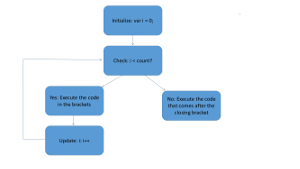

# For Loops

We've seen how to give Karel instructions, but so far we've given each command one at a time.  But what if we want Karel to move 40 times?  Or what if we want Karel to put down 135 balls in one spot?  Do we really have to type ```putBall()``` 135 times?  The good news is no we don't!

### Why For Loops?
For loops let us type a series of commands only  once, then let the program tell Karel to do it multiple times. It is important to note that for loops are used when we want a fixed number of repetitions. For example, we could use a for loop if we want to move 10 spaces or put down 150 balls.  In both of these cases, we have a fixed number of times we want a specific set of instructions to be executed.

### Using For Loops
The syntax of a for loop is as follows:

```
for(var i = 0; i < count; i++)
{
    //code you want repeated
}
```

This piece of code says the variable `i` will start with the value 0.  Then, as long as `i < count`, the code you want repeated will execute.  The variable `i` increases by one after every time the code is executed, since we have `i++`.

Let's make Karel put down 5 balls.  In this case, `count` will be 5, because we want something to happen 5 times.  The code inside of the for loop will be `putBall()` because that's what we want to happen 5 times.  The for loop looks like this:

```
for(var i = 0; i < 5; i++){
    putBall();
}
```


### Test Yourself!!