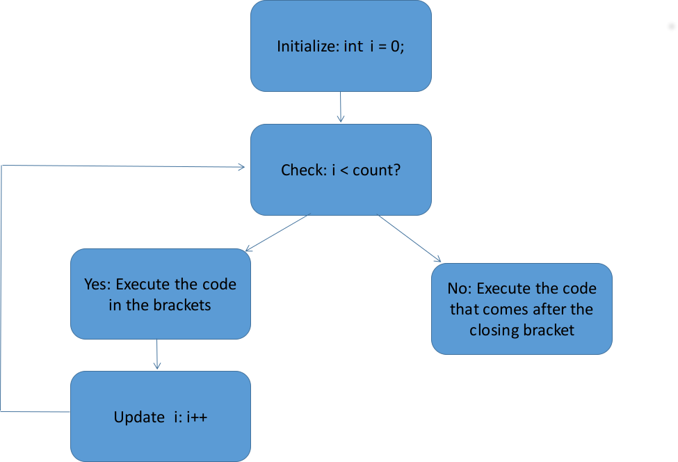
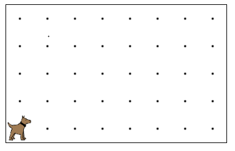
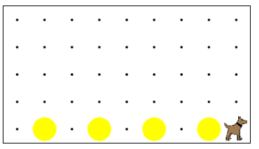

# For Loops
We've seen how to give Karel instructions, but so far we've given each command one at a time.  But what if we want Karel to move 40 times?  Or what if we want Karel to put down 135 balls in one spot?  Do we really have to type ```putBall()``` 135 times?  The good news is, no we don't!

### Why For Loops?
For loops let us type a series of commands only  once, then let the program tell Karel to do it multiple times. It is important to note that for loops are used when we want a fixed number of repetitions. For example, we could use a for loop if we want to move 10 spaces or put down 150 balls.  In both of these cases, we have a fixed number of times we want to execute a specific set of instructions to.

### Using For Loops
The syntax of a for loop is as follows:

```
for(int i = 0; i < count; i++)
{
    //code you want repeated
}
```

A for loop consists of three parts: the header, the curly braces, and the code inside of the curly braces. The curly braces are there to designate what code you want repeated.  All of the code between the curly braces will be repeated.  You can put any commands you want Karel to do to inside of the for loop.

The header is made up of three parts: initialization, the conditional, and update. You must separate each of these parts with a semicolon, but be careful to **not** put a semicolon after the closing parenthesis! The initialization part simply declares and initializes your loop variable -- `int i = 0;`.  The conditional part is how you specify how many times you want the loop to execute -- `i < count`.  This works by only letting `i` reach a particular value. The update part lets you choose how `i` should be incremented after each time the loop executes -- `i++`.  In the example above, we've specified that `i` should have one added to the value each time.  

The flow chart below shows the flow of execution in a for loop.





### Be Careful!
There are several things that you want to make sure to watch out for when using for loops.

1. Don't put a semicolon after the closing parenthesis of the header.  This will cause the for loop to not repeat the code in the body of the loop.
2. Put spaces around the operators in the header.  The equals sign and less than symbol should have spaces around them.
3. Put spaces between each part of the header. You should end the initialization and conditional parts with a semicolon and space. None of this squished nonsense: ~~`for(int i=0;i<0;i++)`~~ 
4. Make sure all of the code you want to be in the body of the loop is between the curly braces.  Only code in the curly braces will be considered as part of the loop.


### Examples
#### Example One
Let's make Karel put down 5 balls.  In this case, we'll initialize `i` to 0, and `count` will be 5, because we want something to happen 5 times.  The code inside of the for loop will be `putBall()` because that's what we want to happen 5 times.  The for loop looks like this:

```
for(int i = 0; i < 5; i++){
    putBall();
}
```

#### Example Two
This time, we want to have Karel move, put down a ball, and move again.

Here is what the starting world looks like:

 

Here's what we want the ending world to look like:



How can we build a for loop to do this? Let's build the loop from the inside out.  What do we want Karel to do each iteration?  Karel should 1) move, 2) put down a ball, and 3) move again. The body of the for loop would look like this:

``` 
for(){
    move();
    putBall();
    move();
}```

Now, let's look at the world.  It has 9 avenues.  However, since we're telling Karel to move twice, we can't use `i < 9` because we'd make Karel crash into the wall!  If we were only moving once, then we would iterate 9 times.  Since we're moving twice, we can only iterate 9/2 times.  We'll round down and say that 9/2 = 4.5 and rounded is 4.  We need the loop to iterate four times! Why didn't we round up to five? Look at the picture of the ending world.  There is only room for four balls.  If we had looped five times, Karel would have still crashed into the wall.

Here's the final for loop

```
for(int i = 0; i < 4; i++){
  move();
  putBall();
  move();
}
```

### Summary
For loops are a convenient way to repeat chunks of code.  We can use for loops when we have a fixed number of iterations.  A for loop is made of three parts: the header, the body, and the curly braces.  The header has the initialization, condition, and update information.  THe opening curly brace comes before the body. The body is made up of the statements that should be repeated. The closing curly brace finishes up the for loop and tells the program that we're done with the code we want repeated.


