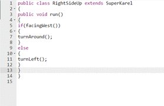

# How to Indent Your Code

Indentations are responsible for making your code easy to read and understand. Indenting your code is always best practice as it helps to show the overall structure of your code.



## Indenting Your Code

A general rule for Java is to ***always*** place brackets on their own lines, and indent the code within the brackets. Here is an example for you to reference:

```
// Notice how the brackets are on new lines and the code within is indented.
public void run()
{  
    move();
    turnLeft();
    move();
}
```


You apply the same rule for indentations when using nested control structures. Consider this example:

```
// Notice how the brackets are on new lines and the code within is indented.
public void run() 
{
    while(ballsPresent())
    {
        if(frontIsClear())
        {
            move();
        }
    }
}
```


## Practice Questions

**1)** Consider the following piece of code:
```
public class WalkRoadKarel extends SuperKarel
{
public void run()
{
    while(frontIsClear())
    {
        move();
    }
}
}
```
<p> Does this piece of code have proper indentations? </p>
- [ ] Yes
- [x] No
 
> Very close! Remember, we want to indent everything within the brackets. Everything within your class's brackets is missing an indentation.

> This is the correct answer! Nice job!


**2)** Consider the following piece of code:
```
public classCleanRoad extends SuperKarel
{
    public void run()
    {
        while(frontIsClear())
        {
            if(ballsPresent())
            {
                takeBall();
            }
            move();
        }
    }
}
```
<p> Does this piece of code have proper indentations? </p>
- [x] Yes
- [ ] No
 
> This is the correct answer! Nice job!

> Almost! This piece of does have proper indentations, because each bracket has it's own line and every piece of code within the brackets has an indentation.