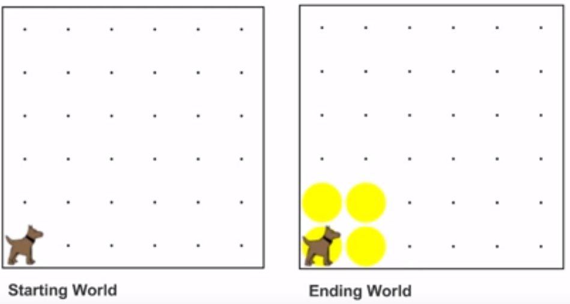

# Java Programs and the Run Method

So far, we have been writing our Java programs as a series of commands. However, a truly proper Java program requires a few additional parts. From now on, we will write our commands inside of a **class** and **method**.

## Writing a Java Class

The general format for writing a Java **class** is:

```
public class ClassName extends SomeOtherClass
{

}
```

Let's break this down a little further by looking at each of these parts individually:

* `public` - The visibility of the class. For right now, all of our classes will be *public*.
* `class` - This simply tells Java that we are writing a class.
* `ClassName` - The name of the class. You can name your class anything, but the name should make sense and describe your program appropriately. Class names are written in *UpperCamelCase*, where each word starts with a capital letter.
* `extends SomeOtherClass` -  Extending *SomeOtherClass* allows us to use properties and methods from that class. This is known as *inheritance*. You will learn more about *inheritance* as well as the *extends* keyword in future chapters.
* **`{` `}`** - Classes start with an opening curly bracket (`{`) and end with a closing curly bracket (`}`). The rest of our program goes in between these two brackets.

Let's look at an example:

```
public class SquareKarel extends Karel
{

}
```

In this example, **SquareKarel** is the name of our class. Our **SquareKarel** class **extends** the **Karel** class. This allows us to write a Karel program. You will learn more about this later, but for right now, you will only extend the **Karel** class. 


## Adding The Run Method

A **class** contains **methods**. Before we begin writing our code, we need to add a **run method** to our class. The run method is where our program starts its execution.

```
public class SquareKarel extends Karel
{
    public void run()
    {
        // Our code here
    }
}
```

The run method spans a total of four lines. It is indented inside of the opening and closing curly brackets (`{}`) of the class body. The run method has its own set of curly brackets (`{}`). We write our Karel commands within the run method's curly brackets.

Let's look at an example:

```
public class MoveKarel extends Karel
{
    public void run()
    {
        move();
    }
}
```

When we run this program, Karel will simply move forward one spot.


## Square Karel as a Full Java Program

Let's rewrite our second Karel program, `SquareKarel`, as a full and proper Java program. What would it look like?



We simply encapsulate our code from before inside of the **run method**. The run method is inside of our `SquareKarel` **class**.

```
/* SquareKarel
 * This program has karel place a square of tennis balls
 * and return to his starting point.
 */
public class SquareKarel extends Karel
{
    public void run()
    {
        //Karel begins facing east
        putBall();
        move();
        turnLeft(); //Karel is now facing north
        
        putBall();
        move();
        turnLeft(); //Karel is now facing west
        
        putBall();
        move();
        turnLeft(); //Karel is now facing south
        
        putBall();
        move();
        turnLeft(); //Karel finishes facing east.
    }
}
```
