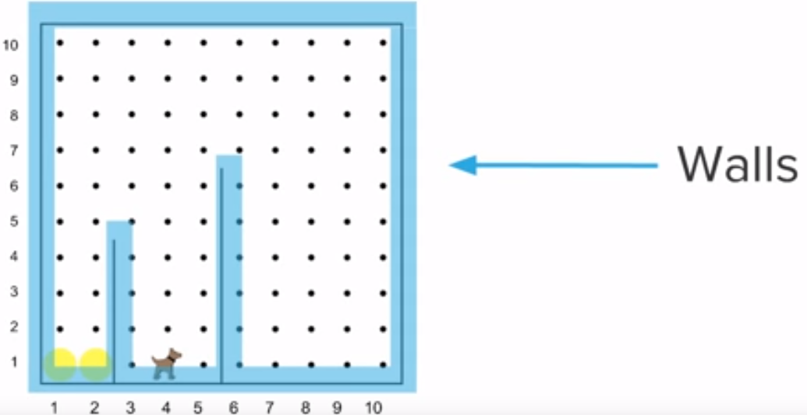
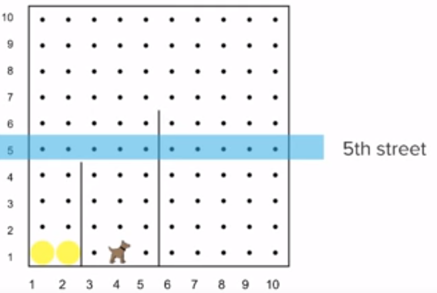
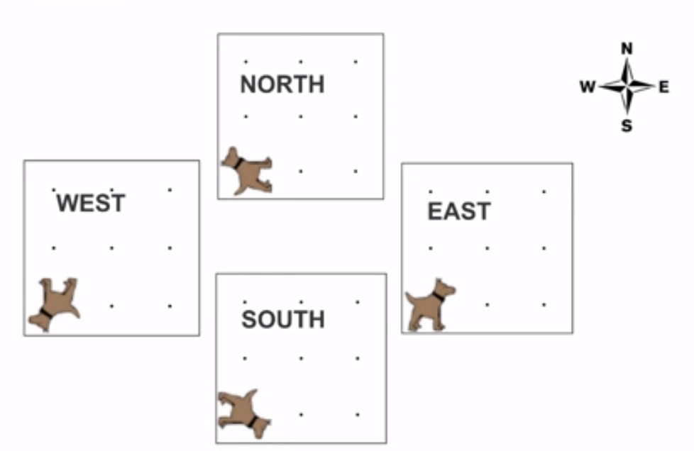
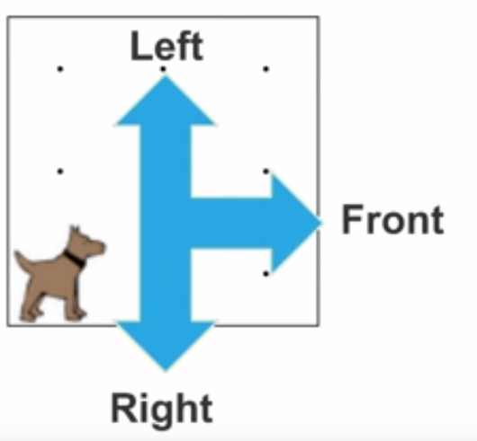
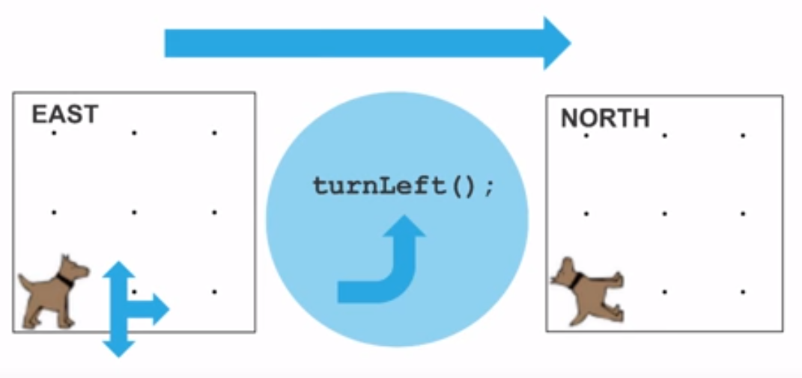
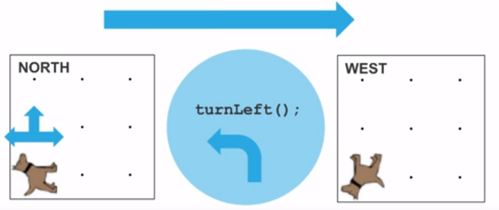

# More Basic Karel

Karel can navigate a world by moving and turning left within it. Karel can also take balls and put balls down. Recall that these are the only four commands Karel knows:

    move();
    putBall();
    takeBall();
    turnLeft();
    
Karel resides in a boxed-in world. Let's review the basic components of Karel's world.

## Karel's World

Karel's world is a grid composed of **walls**, **streets**, and **avenues**.

### Walls:

**Walls** block Karel's movement. Walls include the borders of a world as well as any lines running through the world.

Karel cannot move through walls! If Karel attempts a `move();` command while directly in front of a wall, Karel will **crash** into it.

### Streets:

A **street** is a **row** in the grid.

The *5th row*, or *5th street*, is highlighted in the example world above.

### Avenues:

An **avenue** is a **column** in the grid.

The *8th column*, or *8th avenue*, is highlighted in the example world above.

## Karel's Direction

Karel can face one of four directions at any given time - **north**, **east**, **south**, or **west**. The direction Karel is facing determines which direction Karel will move. If Karel is facing north, a `move();` command will make Karel move up. If Karel is facing east, a `move();` command will make Karel move to the right. The same is true for the south and west directions.

Karel can always go **right**, **left**, or **forward** from any position.

For example, if Karel is initially facing east, a `turnLeft();` command will result in Karel facing north.

Similarly, if Karel is initially facing north, a `turnLeft();` command will result in Karel facing west.

## Our Second Karel Program

Using our knowledge of direction, let's have Karel make a square out of balls.

Here is the solution. The comments explain which direction Karel ends up facing after each `turnLeft();` command.
    
    /* Tennis Ball Square
     * This program has karel place a square of tennis balls
     * and return to his starting point.
     */
     
    //Karel begins facing east
    putBall();
    move();
    turnLeft(); //Karel is now facing north
    
    putBall();
    move();
    turnLeft(); //Karel is now facing west
    
    putBall();
    move();
    turnLeft(); //Karel is now facing south
    
    putBall();
    move();
    turnLeft(); //Karel finishes facing east.