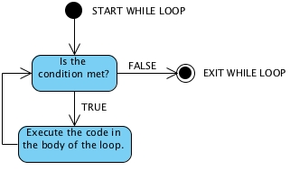

# While Loops in Karel

Lets say Karel is standing on one side of the world, and we want to move to the next side. Up to this point the best way would be to write a for loop that repeats the ```move();``` command a set number of times. What if we don't know the size of Karel's world? In this case we would use a while loop, which iterates a command while a condition is true. 

## Basics of While Loops

While loops, unlike for loops, execute the target statement as long as the condition is true. 

A while loop is usually formatted like:
```
while(condition)
{
    // code to iterate
}
```

A while loop will ***only*** repeat the target statement until the condition is no longer true. Consider the following diagram:



## Examples of While Loops

Consider at the following situation:

 - While a vehicle's engine is on, it will use gas. 
 - When the vehicle's engine is off, it will no longer use gas.
 

In this case the vehicle's engine represents the condition of our while loop. The use of gas represents our target statement that will only execute when the condition is met. Your code for this situation should look like:
``` 
while(engineOn)
{
    useGas();
}
```
Here is another example of a while loop, as seen in Karel's world:

 - While a ball is present in Karel's current position, move one space.
 - When Karel lands on a position that does not contain a ball, don't move.


In this situation Karel will only move when a ball is in Karel's current position. As soon as Karel lands in a position that does not contain a ball the loop will exit, and Karel will stop moving. The code for this situation should look like:
```
while(ballsPresent())
{
    move();
}
```

## While Loop Practice Exercises


<p>Consider the situation where we want Karel to move to a position without a ball. </p>


---

<p>Which while loop is correct for this situation? </p>
<p> Question </p>
 - [ ] This is answer One
 - [ ] This is answer Two
 - [x] This is answer three
 
> The answer is incorrect.

> Answer two is incorrect

> Correct!

---