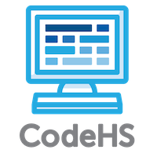

# AP Computer Science in Java

Learn computer science and prepare for the AP exam with CodeHS. Check out the course at [CodeHS](https://codehs.com/course/info/apjava) and [read the book](https://www.gitbook.com/book/codehs/apjava/content/) online at GitBook!

### Contributors
We'd like to thank all those who have helped write this book:

- Karel the Dog (@karelthedog, http://karelthedog.com/)

- Michael Goheen

- Neil Shankar

- Kurt Hepler

- Vincent Xie

- Sachi Williamson

- Wezley Sherman 
 
- Kathryn Rodgers

